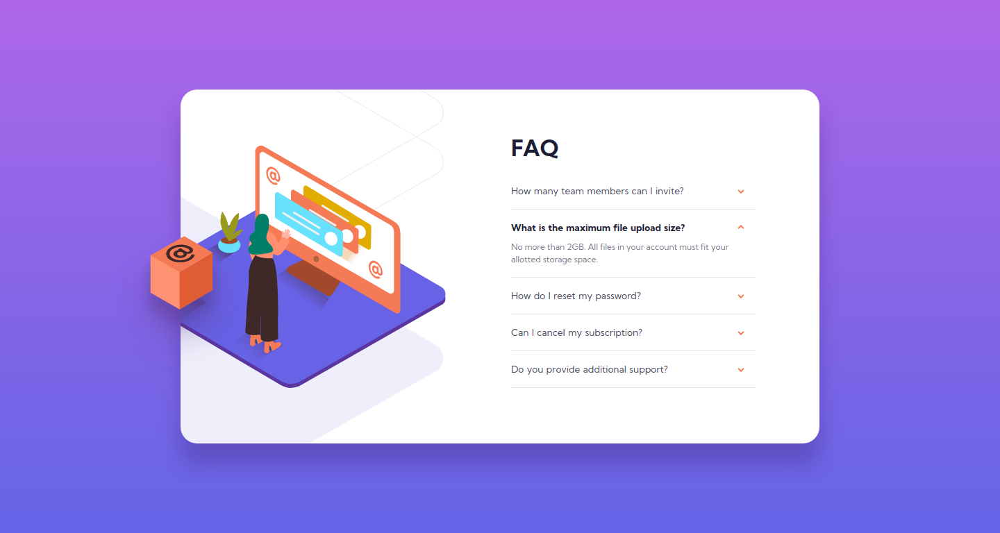
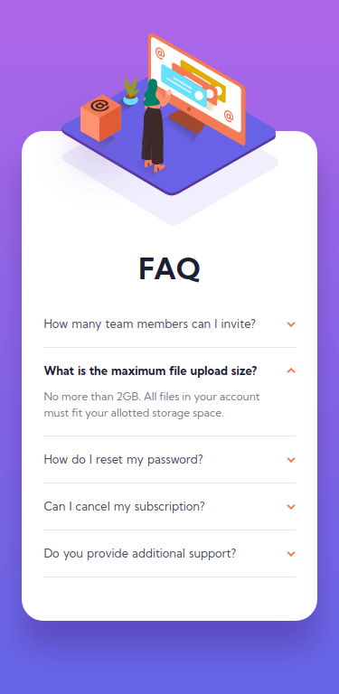

# Frontend Mentor - FAQ accordion card solution

This is a solution to the [FAQ accordion card challenge on Frontend Mentor](https://www.frontendmentor.io/challenges/faq-accordion-card-XlyjD0Oam). Frontend Mentor challenges help you improve your coding skills by building realistic projects. 

## Overview

### The challenge

Users should be able to:

- View the optimal layout for the component depending on their device's screen size
- See hover states for all interactive elements on the page
- Hide/Show the answer to a question when the question is clicked

### Screenshots

## My process

### Built with

- Mobile-first workflow
- CSS custom properties
- Flexbox
- CSS Grid
- JavaScript

### What I learned

Using CSS animation and JavaScript, both of which I'm still learning, in a project without following a tutorial.

### Useful resources

- [50 Projects in 50 Days](https://50projects50days.com/) - I recently completed this course and was able to use some of the same things we learned there in this project.